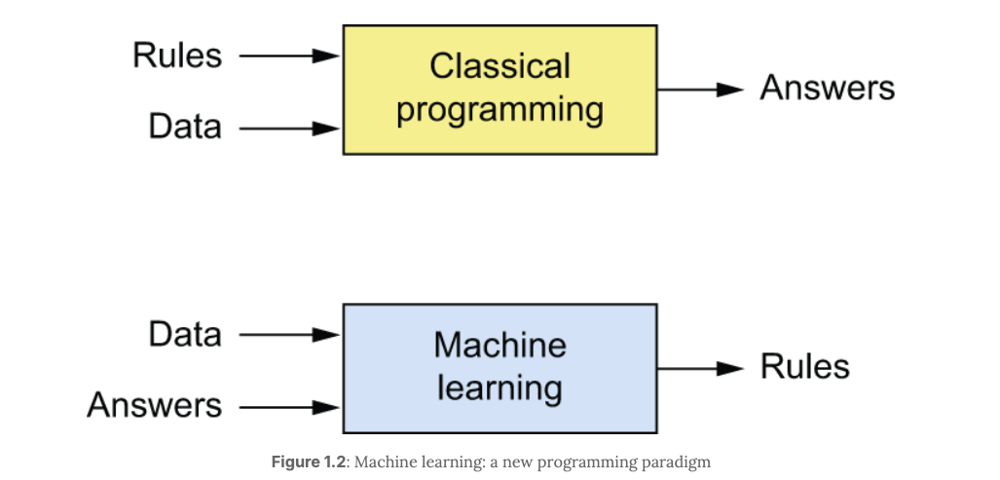
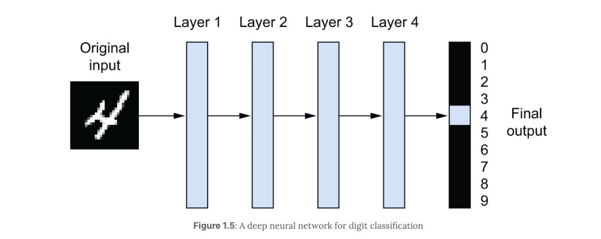
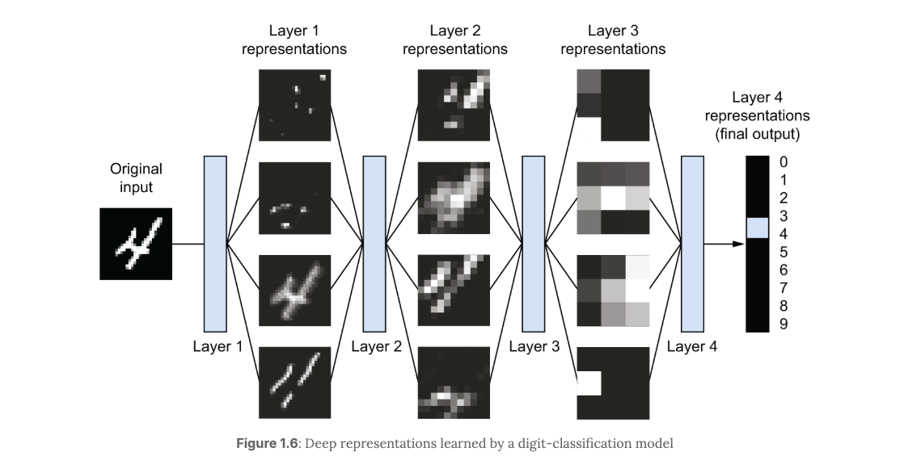
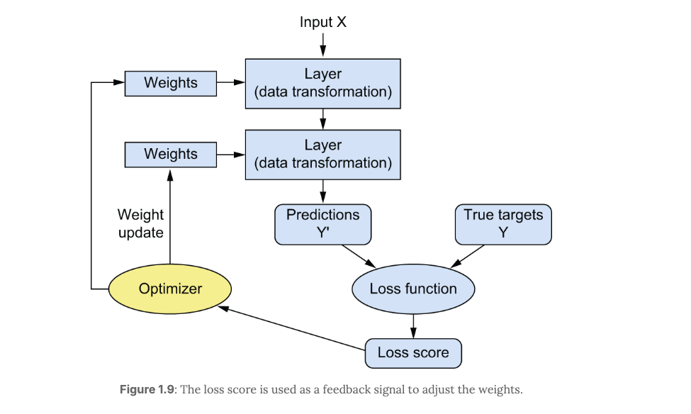

# Chapter 1 - What is deep learning?

## Artificial Intelligence, machine learning, and deep learning

### Artificial Intelligence

- AI can be described as the effort to automate intellectual tasks normally performed by humans.

- Symbolic AI: Sufficiently large set of explicit rules for manipulating knowledge stored in explicit databases. 

### Machine Learning

- Machine Learning: The machine looks at input data and the corresponding answers, and figures out what the rules should be.

### Learning rules and representations from data

- 3 Things in Machine Learning:
1. Input data points
2. Examples of the expected output
3. A way to measure whether the algorithm is doing a good job

- Learning: The measurement between the machine learning algorithm's current output and the expected output used as a feedback signal to adjust the way the algorithm works.

- Central problem of machine learning: to meaningfully transform data: to learn useful representations of the input data at hand - representations that get us closer to the expected output.

- Representations: A different way to look at data to represent or encode data.  
    - Ex. Encoding an image in RBG or HSV format. These are different representations of the same data/image.

### The "deep" in "deep learning"

- Deep Learning: Learning 

- Depth of Deep Learning: A new take on learning representations from data, which emphasizes learning successive layers of increasingly meaninful representations.
    - "Deep" -> Successive layers of representations
    - "Depth" -> How many many layers contribute to the model of the data.

- Neural Networks: Layered representation models. 
    - Ex. The network transforms the digit image into representations that are increasingly different from the original image and increasingly more informative about the final result. 
        - Multistage information-distillation process, where information goes through successive filters and comes out increasingly *purified*.

### Understanding how deep learning works, in three figures

- Weights: Parameter factors applied at each network layer that adjust the output (the specification of what a layer does to its input data).
    - Transformation implemented by a layer is parameterized by its weights
    - In this context, *learning* means finding a set of values for the weights of all layers in a network, such that the network will correctly map example inputs to their associated targets.

- Loss Function (objective function/cost function): A function, when given the output prediction of the network and the expected true results computes a "loss score". 

- Loss Score: A value computed by the loss function that determines the success of the output of the network when compared to the expected results.
    - Lower the loss score, better the results.
    - Goal is to obtain a loss score that is as low as possible (as close to the expected result)
    - This score is a feedback siganl to adjust the value of the weights a little, in a direction that will lower the lower the loss score.
    - The loss score is fed into an *optimizer* which will update the weight values at each layer of the network.

- Optimizer: A function that when given a loss score will adjust the weights at each network layer if needed to hopefully produces a lower loss score (closer to the expected results).
    - This is called the *Backpropagation* algorithm: the central algorithm in deep learning.

### What makes deep learning different

- Feature Engineering: Making the initial input data more amenable to processing by these methods: they had to manually engineer good representations for their data.
    - Manually tailoring the input data to recieve better results. 
    - In deep learning this process is moved inside the system rather than human interjection.

- Moore's Law: The idea that the number of available transistors will double roughly every 2 years. 

- Simplicity: Automates *feature engineering*: with deep learning, you learn all features in one pass rather than having to engineer them yourself.

- Scalability: Highly amenable to parallelization on GPUs or more specialized machine learning hardware, so it can take full advantage of Moore's law. 

- Versatility and Reusability: Deep learning models can be trained on additional data without restarting from scratch, making them viable for continuous online learning.

### The age of generative AI

- Generative AI: Powered by very large *foundation* models that learn to reconstruct the text and image content fed into them (reconstruct a sharp image from a noisy one, predict the next word in a sentence, etc.) 
    - The expected *targets* are taken from the input itself. Self-supervised learning.

### What deep learning has achieved so far

### Beware of the short-term hype

### Summer can turn to winter

### The promise of AI

