# Chapter 2 - The mathematical building blocks of neural networks

## A first look at a neural network

- Keras: A machine learning library used to learn to classify handwritten digits.

- MNIST Dataset: A set of 60,000 training images + 10,000 test images.
    - Assembled by the National Institute of Standards and Technology (NIST) in 1980s.

- Class: A Category in a classification problem.
    - One possible category the model can predict.
        - Ex. Handwritten Digits: 0 - 9
- Samples: Datapoints.
    - One individual example/datapoint.
        - Ex. an image of an abstract "1" in our dataset
- Label: The Class associated with a specific Sample. 
    - The correct answer attached to that sample.
        - Ex. an image of an abstract "1" has a correct/expected answer of 1.
        
- Numpy: Popular Python library for numerical computation.
    - Lacks GPU and autodifferentiation but NumPy arrays are often used as a numerical data exchange format.

## Data representations for neural networks

- Tensor: A container for numbers. Machine learning systems use tensors as their basic data structure.
    - Dimension (aka axis): Display the number of axes a tensor has by calling the `ndim` attr.

    1. Scalars (rank-0 tensors): A tensor that only contains one number is called a *scalar* (scalar tensor, rank-0 tensor, or 0D tensor).
        - In NumPy: `float32` or `float64` is a scalar tensor (or scalar array).
        - `ndim` == 0
        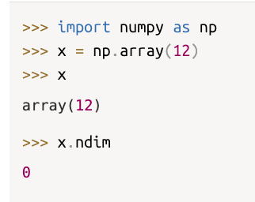
    2. Vectors (rank-1 tensors): An array of numbers is called a vector (rank-1 tensor, 1D tensor).
        - Exactly 1 axis
        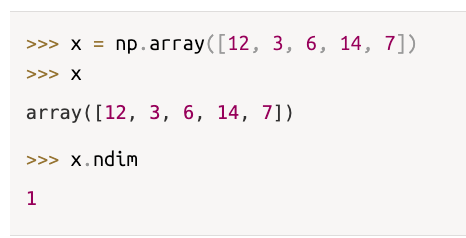
        - This vector has 5 entries so it is a *5-dimensional vector* NOT A 5D Tensor!
        - A 5D vector has only one axis and has five dimensions along its axis, whereas a 5D tensor has five axes (and may have any number of dimensions along each axis).
        - Dimensionality: Can denote either the number of entries along a specific axis (as in the case of our 5D vector) or the number of axes in a tensor (such as a 5D tensor).
    3. Matrices (rank-2 tensors): An array of vectors is a matrix (or rank-2 tensor or 2D tensor).
        - A matrix has two axes (often referred to as rows and columns)
        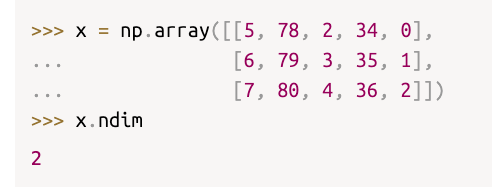

    4. Rank-3 tensors and higher-rank tensors
        - Rank-3 Tensor: If you pack such matrices in a new array, you obtain a rank-3 tensor (or 3D tensor), which you can visually interpret as a cube of numbers.
        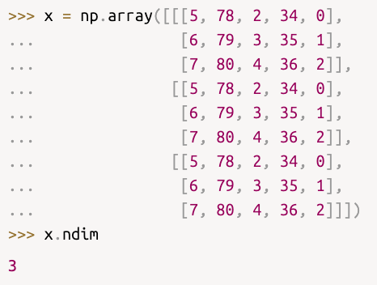
        - Higher-rank Tensors: By packing rank-3 tensors in an array, you can create a rank-4 tensor, and so on.
    
- Key attributes of tensors:
    1. Number of axes (rank) - For instance, a rank-3 tensor has three axes, and a matrix has two axes. This is also called the tensor’s ndim in Python libraries such as NumPy, JAX, TensorFlow, and PyTorch.
    2. Shape:  This is a tuple of integers that describes how many dimensions the tensor has along each axis. 
        - For instance, the a matrix example has shape (3, 5), an array of 3 vectors each with 5 dimensions. 
        - A rank-3 tensor example has shape (3, 3, 5), an array of 3 arrays, where each array has 3 vectors and each vector has 5 dimensions. A vector has a shape with a single element, such as (5,), whereas a scalar has an empty shape, ().
    3. Data type (`dtype`): This is the type of the data contained in the tensor; for instance, a tensor’s type could be `float16`, `float32`, `float64`, `uint8`, `bool`, and so on. 
        - In TensorFlow, you are also likely to come across `string` tensors.

## Manipulating tensors in NumPy

- Tensor Slicing: Selecting specific elements in a tensor (python list slicing)

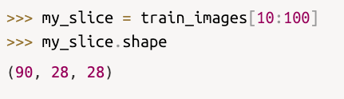

- You can slice each shape parameter and use negative index.
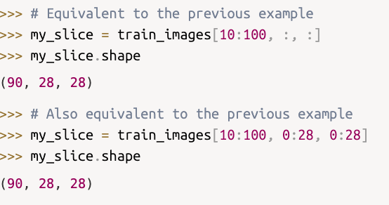

- The notion of data batches
    - The first axis (axis 0) in all data tensors will be the *sample axis*.
        - In the MNIST example, “samples” are images of digits.
    - The entire dataset is not typically processed all at once, but instead in batches.
    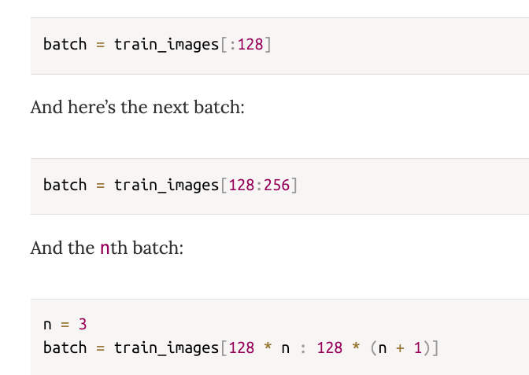
    - Batch axis (batch dimension): the first axis when considering a batch tensor.

## Real-world examples of data tensors

1. Vector data - Rank-2 tensors of shape (samples, features) where each sample is a vector of numerical attributes ("features").

2. Timeseries data or sequence data - Rank-3 Tensors of shape (samples, timesteps, features) where each sample is a sequence (of length timesteps) of feature vectors.

3. Images - Rank-4 tensors of shape (samples, height, width, channels) where each samle is a 2D grid of pixels and each pixel is represented by a vector of values ("channels")

4. Video - Rank-5 tensors of shape (samples, frames, height, width, channels) where each sample is a sequence (of length frames) of images.

## The gears of neural networks: Tensor operations 

- Tensor Operations: transformations learned by deep neural networks that can be reduced to a handful of tensor operations (or tensor functions) applied to tensors of numeric data.

- Element-wise Operations: Perform the same operation independently to every element.

- Broadcasting: Similar to type casting but for tensor shapes. When performing addition of a 2D tensor + 1D tensor the smaller tensor will be broadcast to match the shape of the larger tensor.
    1. Axes( called broadcast axes) are added to the smaller tensor to match the `ndim` of the larger tensor.
    2. The smaller tensor is repeated alongside these new axes to match the full shape of the larger tensor.

- Tensor product: Also called the dot product or matmul.
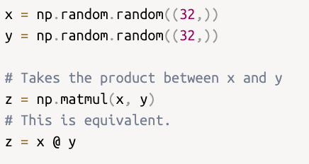
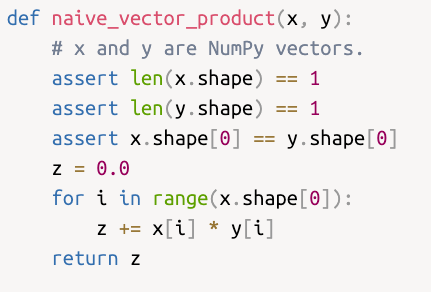

- Tensor reshaping: rearranging its rows and columns to match a target shape.
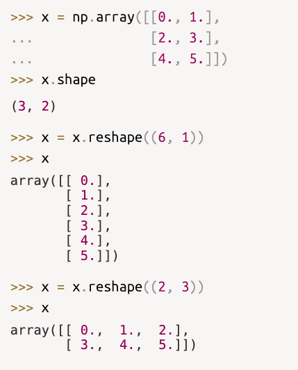

- Transposition: Exchanging a matrix's rows for its columns
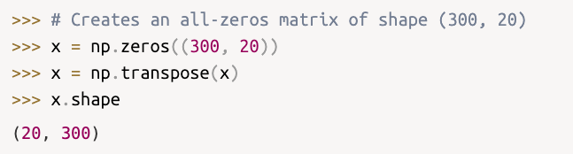

- Geometric interpretations of tensor operations

1. Translation: adding a vector to a point will move this point by a fixed amount in a fixed direction. 
    - Applying a translation to a set of points (an object).
    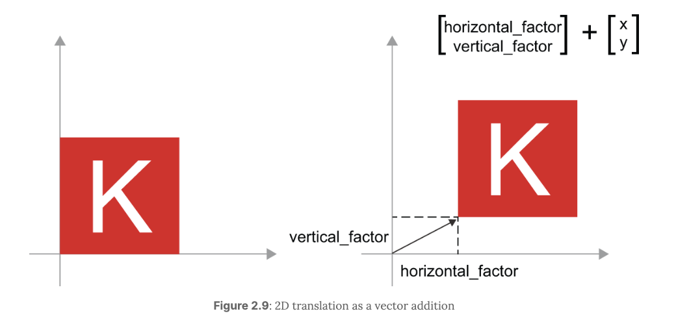

2. Rotation: A counterclockwise rotation of a 2D vector by an angle theta can be achieved via a product with a 2 x 2 matrix: `R [[cost(theta), -sin(theta)], [sin(theta), cos(theta)]]`

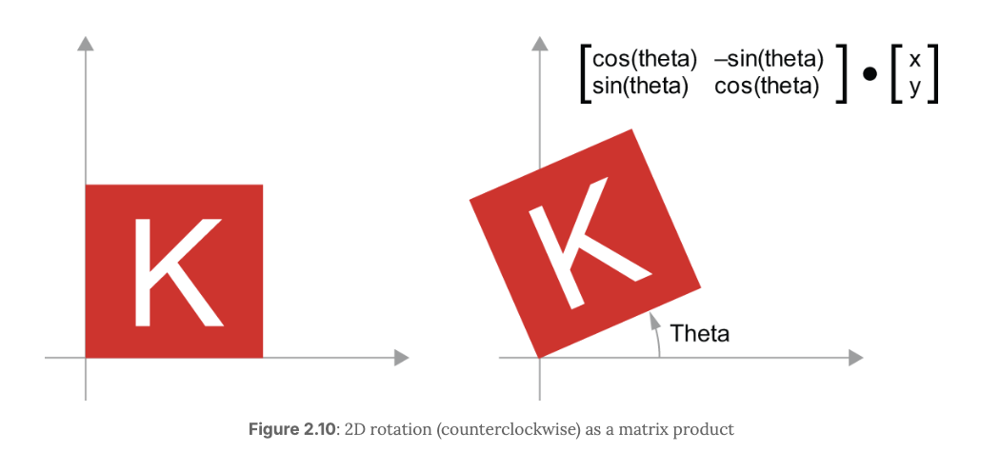

3. Scaling: A vertical and horizontal scaling of the image (see figure 2.11) can be achieved via a product with a 2 × 2 matrix: `S = [[horizontal_factor, 0], [0, vertical_factor]]`
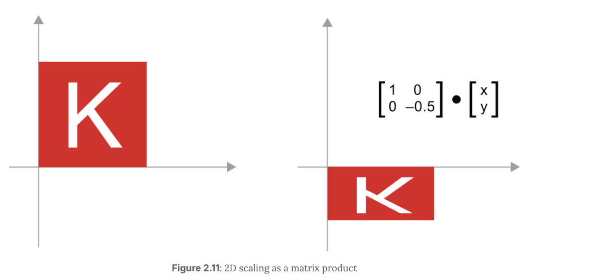

4. Linear Transform: A product with an arbitrary matrix implements a linear transform. Note that scaling and rotation, seen previously, are, by definition, linear transforms.

5. Affine transform: The combination of a linear transform (achieved via a matrix product) and a translation (achieved via a vector addition): `y = W @ x + b` -> W matmul x + b 
    - Same computation that is implemented in the karas.layers.Dense layer. A Dense layer without an activation function is an affine layer.

6. Dense Layer w/ `relu` activation: Multiple affine transformations without activation functions collapse into a single affine transformation.
    - Adding `relu` between Dense layers introduces nonlinearity, allowing the network to bend and reshape the representation space so complex patterns can become separable in ways a purely linear model cannot achieve.

## The engine of neural networks: Gradient-based optimization

