# Chapter 3 - Introduction to TensorFlow, PyTorch, JAX, and Keras

## A brief history of deep learning frameworks

- 3 Key Features of Deep Learning Frameworks:

1. A way to compute gradients for arbitrary differentiable functions (automatic differentiation).
2. A way to run tensor computations on CPUs and GPUs (and possibly even on other specialized deep learning hardware).
3. A way to distribute computation across multiple devices or multiple computers, such as multiple GPUs on one computer, or even multiple GPUs across multiple separate computers.  

- XLA: A high-performance compiler developed to enable TensorFlow to run on TPUs.

- TensorFlow: Released in 2015 by Google
- PyTorch: Released in 2016 by Meta
- JAX: An alternative way to use autodifferentiation with XLA, Google.

## How these frameworks relate to each other

- Low-level Framworks: Tensor manipulation (tensors, tensor operations, backprop.)
1. TensorFlow
2. PyTorch
3. JAX

- High-level Frameworks: High-level deep learning concepts (layers, loss functions, optimizer, metrics, a training loop that performs mini-batch stochastic gradient descent)
1. Keras

## Introduction to TensorFlow

### Tensors and variables in TensorFlow

- Constant Tensors: Tensors need to be created with some initial value, so common ways to create tensors are via `tf.ones` (equivalent to np.ones) and `tf.zeros` (equivalent to np.zeros). 
    - You can also create a tensor from Python or NumPy values using `tf.constant`.
    - `tf.ones`: creates a tensor of given shape filled with `1`.
    - `tf.zeros`: creats a tensor of given shape filled with `0`.
    - `tf.constant`: creates an tensor (array) from Python or NumPy values.

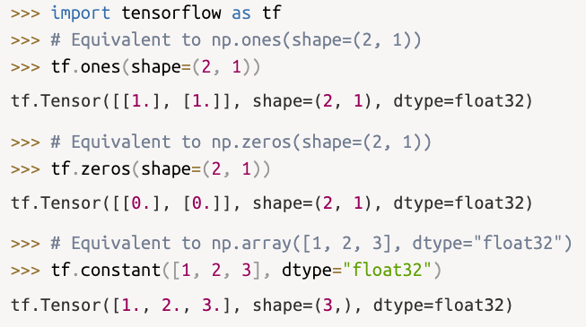

- Random Tensor: reate tensors filled with random values via one of the methods of the `tf.random` submodule.
    - `tf.random.normal`: Tensor of random values drawn from a normal distribution with mean 0 and standard deviation 1.
    - `tf.random.uniform`: Tensor of random values drawn from a uniform distribution between 0 and 1. 

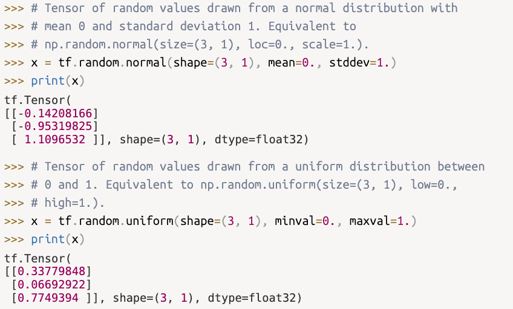

### Tensor assignment and the Variable class

- TensorFlow tensors are constant and therefore not assignable. 

- `tf.Variable`: A class meant to manage modifiable state in TensorFlow.
    - to create a variable you need to provide some initial value such as a random tensor.
    - the state of the variable can be modified with the `assign` method. 
    - `assign_add` and `assign_sub` are efficient equivalents of `+=` and `-=`.

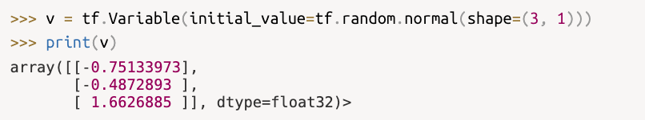
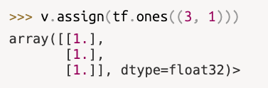

### Tensor operations: Doing math in TensorFlow

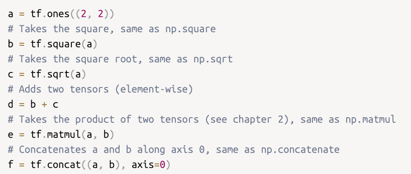

- An equivalent to the Dense layer in Keras for TensorFlow: 
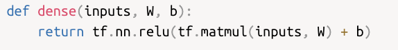

## Gradients in TensorFlow: A second look at the GradientTape API

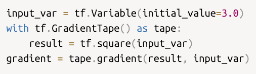

- Commonly used to retrieve the gradients of the loss of a model with respect to its weights: `gradients = tape.gradient(loss, weights)`.

- `tape.watch()` to track constant tensors that are not tf.Variables. 

- You can use nested gradients to compute derivates on derivatives.
    - Ex. Computing a `position` for a falling ball given some `time` via `position(time) = 4.9 * time ** 2`
        - The first derivative of `position` with respect to time (inner_tape) is `speed`.
        - The derivative of `speed` is `acceleration`.

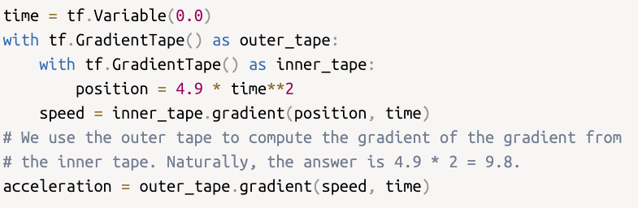

### Making TensorFlow functions fast using compilation

- Decorate your functions with `@tf.function` to have the function be compiled upon the first instance, and all following calls use the compiled version.
    - "Graph mode" is the default mode for compilation of functions using the `@tf.function` decorator. 
    - `jit_compile=True` as a parameter to compile using XLA, a high-performance compiler for ML (short for Accelerated Linear Algebra)

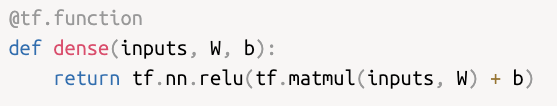
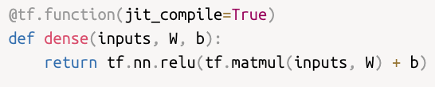

## Introduction to PyTorch

### Tensors and Parameters in PyTorch

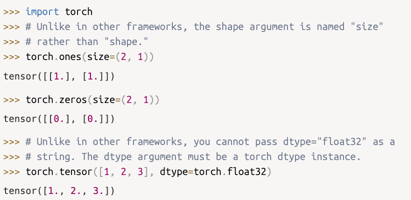

## Introduction to Jax

### Tensors in Jax

## Introduction to Keras

