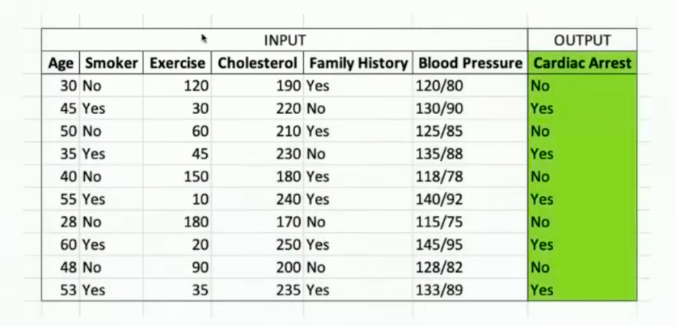

# 1: Introduction to Neural Networks and Deep Learning; Training Deep NNs

- Traditional AI:
    - Goal: Give computer the ability to do tasks that traditionally only humans have been able to do.
    - Why is this so difficult?
        - "We know more than we can tell" (Polanyi's Paradox)
            - We can a lot of things easily but find it very hard to describe how exactly we do them.
        - We can't write down if-then rules to cover all situtations, edge cases etc. 

- Machine Learing: 
    - Goal: Learn form input/output examples to using statistical techniques.
    - Numerous ways to create Machine Learning models:
        - Linear Regression
        - Logisitic Regression
        - Classification and Regression Trees
        - Support Vecotr Machines
        - Random Forests
        - Gradient Boosted Machines
        - Neural Networks
        - ....
    - Structured input data = data that can be "numericalized" into a spreadsheet
    
    -  Unstructured input data (images, videos, etc.)
        - Feature engineering: Manually take unstructured data and try to transform it into a structured format. Creating new "representations" of the data.
            - Developing "good" representations (before ML could be used) requires massive human effort and this "human bottleneck" sharply limited the reach of Machine Learning.
        
- Deep Learning: Deep learning can handle unstructured input data without upfront manual preprocessing.
    - Removed the human bottle neck of structuring unstructured data before it could be processed by ML.
    - Computer power using GPUs
    - Every "sensor" in the world can detect and classify what the data is.

- Generative AI: The ability to create unstructured data.

- What's a Neural Network: Repeated transfored inputs that are finally fed to a linear regression model.

- Logistic Regression: Sending in a vector of numbers into a logistic regression model and get out a probability.

- Weights: Multipliers applied to a value/edge corresponding to its effects on at that computation.

- Neurons that are connected to every other node in the next layer is called a "fully connected" or "dense" layer.

- Activations Functions: The activation function of a node is just a function that receives a single number and outputs a single number (scalare in -> scalar out)
    - Sigmoid Activation Function
    - Linear Activation Function
    - ReLU: Rectified Linear Unit

 

