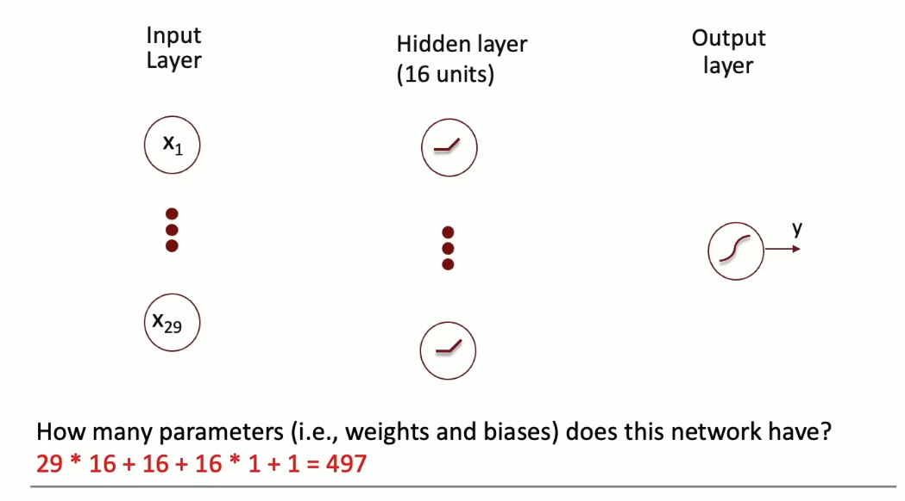
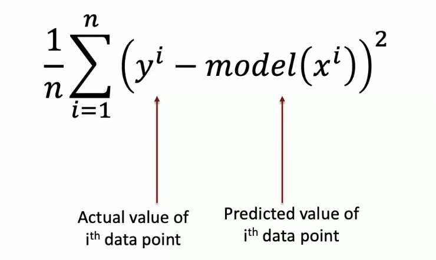
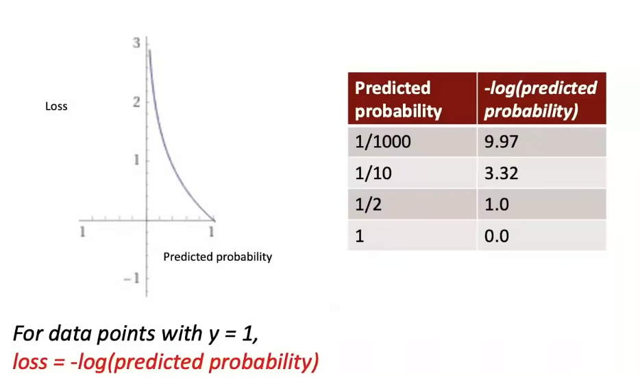
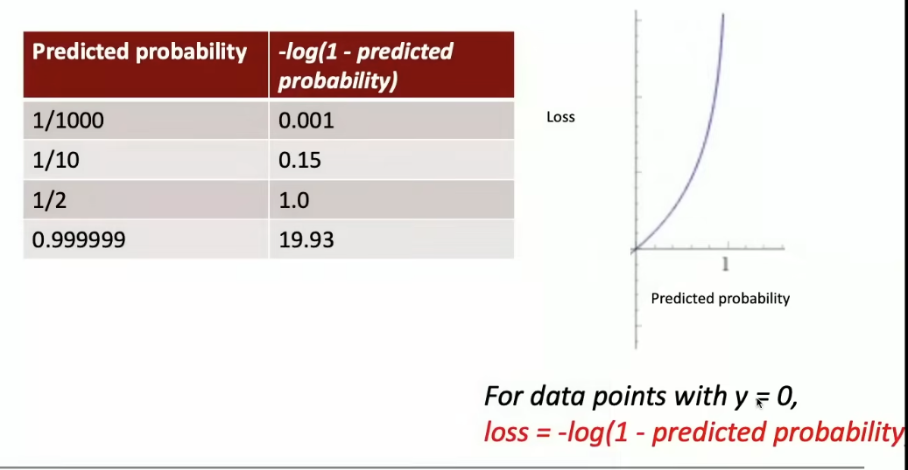
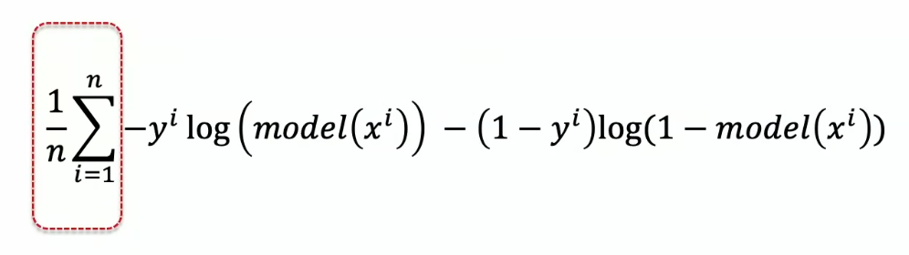
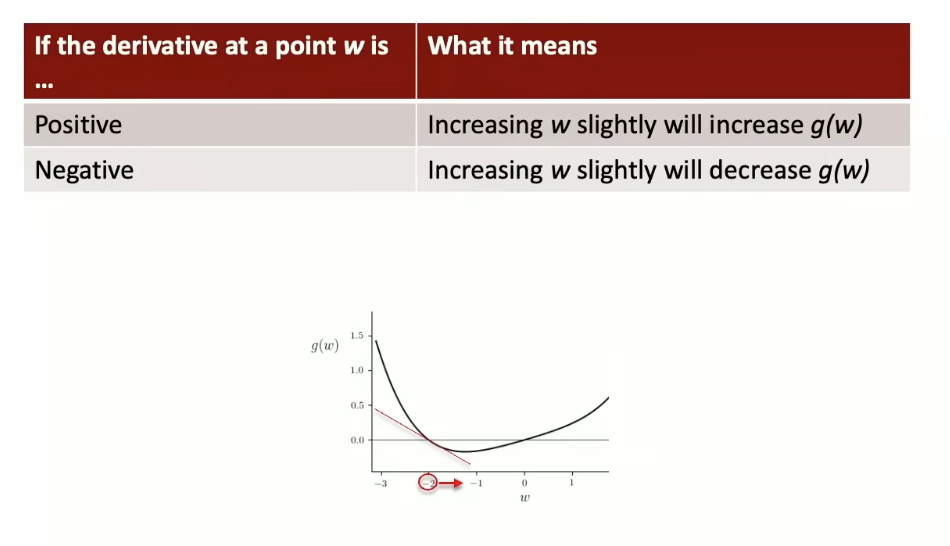
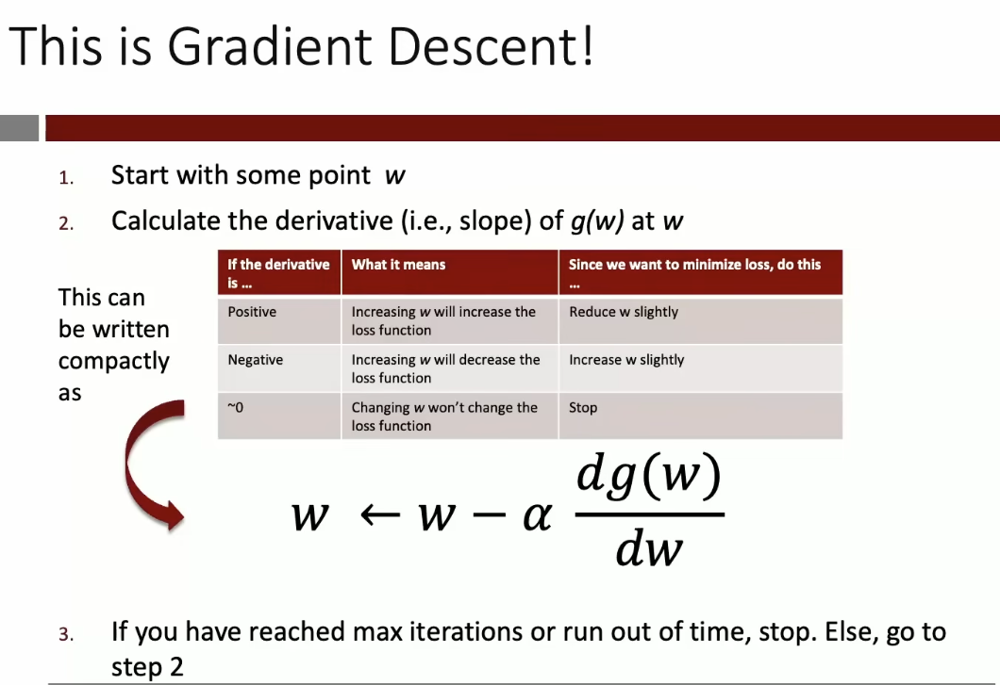
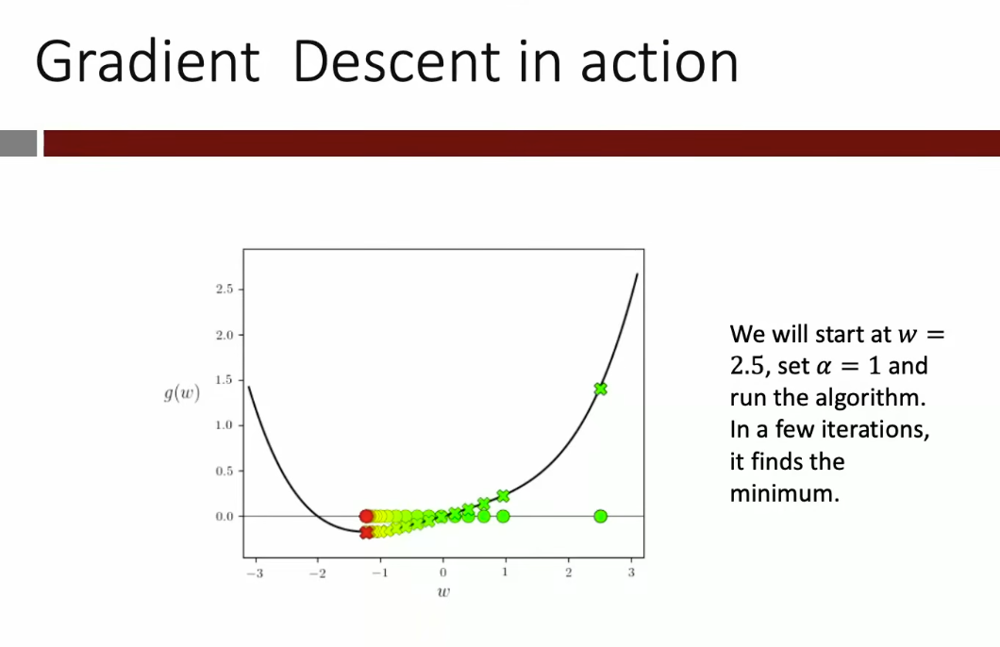
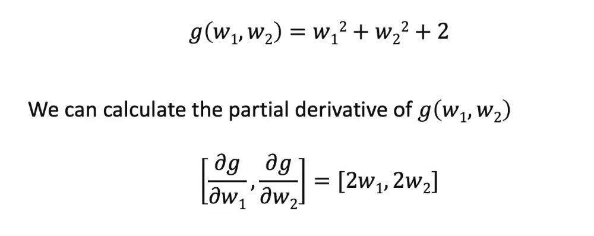

# Lecture 2 - Training Deep NNs (cont.); Introduction to Keras/Tensorflow; Application to Tabular Data
- Things to look up:
    - One hot encoding

- Case Study: Predicting Heart Disease
    - Using a dataset of patients made available be the Cleveland Clinic, build our first NN model to predict if a paitent has been diagnosed with heart disease from demographics and bio-markers.

- Let's Design our NN

1. Lay-out the Network
    - Choose the number of hidden layers and the number of neurons in each layer.
        - at least 1 hidden layer with 16 ReLU (activation) neurons
            - A NN without a hidden layer is just a linear regression model not a NN.
    - Pick the right output layer based on the type of the output.
        - Do we want probability 1 or 0? -> Sigmoid



```python

input = keras.Input(shape=29) # creates the input layer, with 29 parameters or input values

h = keras.layers.Dense(16, activation="relu")(input) # Dense layer fully connects to the other layers w/ 16 nodes in the layer using a ReLU activation function.

output = keras.layers.Dense(1, activation="sigmoid")(h) # create the output layer of 1 node using a sigmoid function.

model = keras.Model(input, output)


```

- The essence of training is to find the "best" values for the weights and biases, those that minimize a function that measures the discrepancy between the actual and predicted values.
    - These functions are called **loss functions** in the deep learning world.

- Loss Functions: quantifies the error in a model's prediction.
    - If the prediction are thclose the the acutal valyes the loss would be small.
    - A perfect model would have a loss of zero.
    - In linear regression you will recall
    - Examples:
        1. Mean Squared Error (MSE) Loss
            - Commonly used for general numerical outputs.
            
            - Examples predicting a continuing value like temperature.
        2. Binary Cross Entropy
            - Classification (0 or 1, True or False)

    
    
    
    - We can combine the two loss scenarios to avoid a if then statement (bad for derivatives etc.) where if y = 1 (heart disease is True) we use the left half and if y = 0 (heart disease False) we use the right have. 
    
    - We can now average this across all `n` data points
       
        - Called "Binary Cross Entropy"
    
Minimizing Loss Functions

- Minimizing a single variable function:
    - Taking the derivitive of a function tells you the slope (rate of change) at a specific point on the function whenmoved slightly in one direction. 
    
    
    - alpha (a) is called the **learning rate** and is our way of ensuring that we increase or decrease `w` slightly
        - It is being multipled against the gradient (derivative at some that point) as a results steeper gradients cause larger movements and as they gradient tapers of the steps shrink to approach the minima.
        

- Minimizing a Multivariable Function
    - Take the "partial" derivative for a function at a specific point with respect to the other parameters.
        - Partial derivatives are taken by holding all other variables constant and solving a derivative for a single variable, the one you are focused on. 
        
        - Vector of partial derivatives.
        - The first number `2w1` is the change in `g(w)` for a small increase in `w1`, with `w2` kept unchanged.
        - The second number `2w2` is the change in `g(w)` for a small increase in `w2` with `w1` kept unchanged.
    - Loop back over all the weights and update the weights but multiplying the learning rate against the negative gradient at that step.

- Backpropagation
    - Backprop is an efficient way to compute the gradient of the loss function
    - The efficiency stems from explouting the layer-by-layer architecture of NNs
    - By organizing the computation in the form of a "computational graph" we can incrementally calculate the gradient on layer at a time using matrix multiplications (and other opertions). This approach also eliminates redundant calculations.
    - It turns out that GPUs originally invented for video games are perfectly suited for matrix multiplications.
    - Backprop + GPUs = Fast calculations of loss function gradients.

- Stochastic Gradient Descent
    - For large datasets computuing the gradient at each step is very expensive.
    - Solution: At each iteration (step of GD) instead of using all the `n` data points in the calculation of the gradient of the loss function, randomly choose just a few of the `n` observations (called a minibatch) and use only these observations to comute the partial derivatives.
        - This is Stochastic Gradient Descent
    - Becuase not all n data points are used in the calculation, this only approximates the true gradient but nevertheless works well in practice. In fact, because it is only an approximation of the true gradient, it can sometimes escape local minima.
    - SGD comes in many "flavors" and we will use a flavor called 
    "Adam" as our default in HODL.


    
