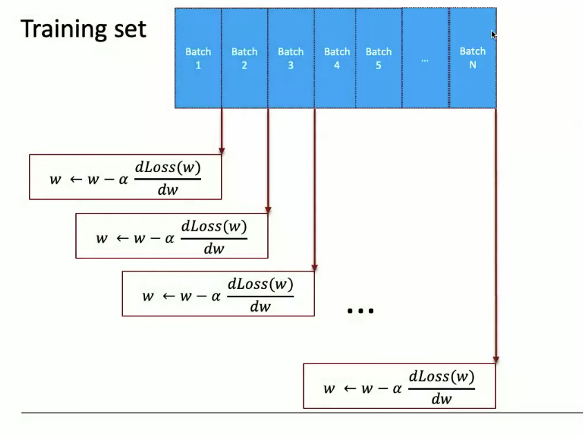
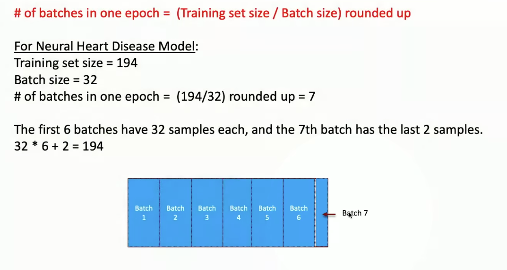
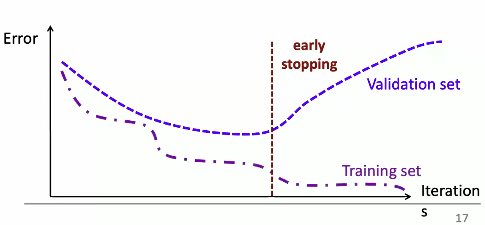
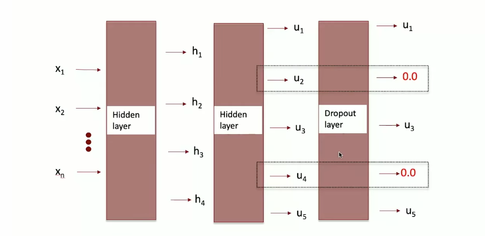
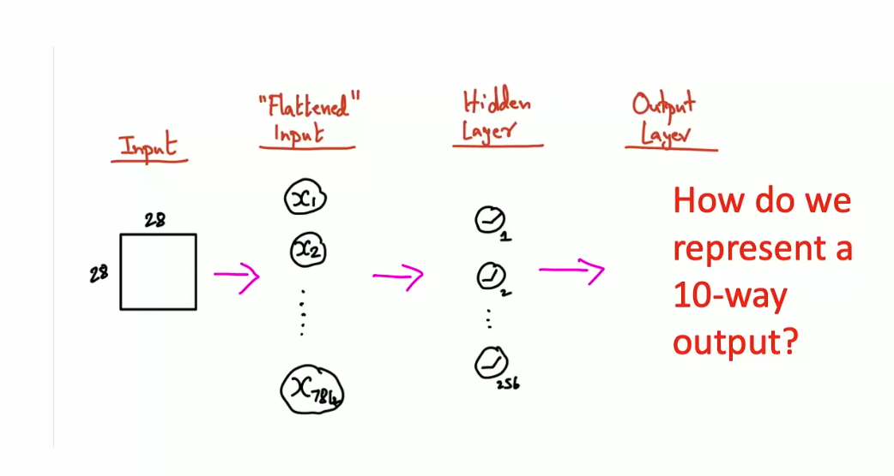
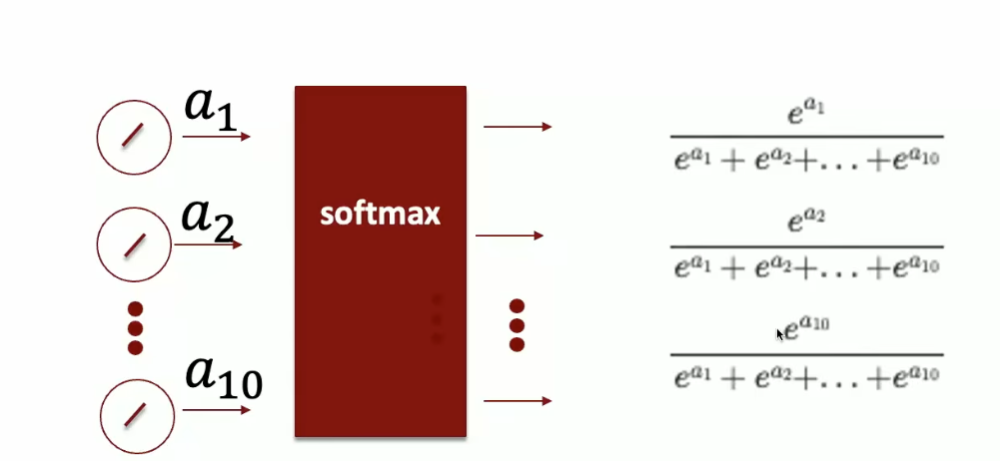
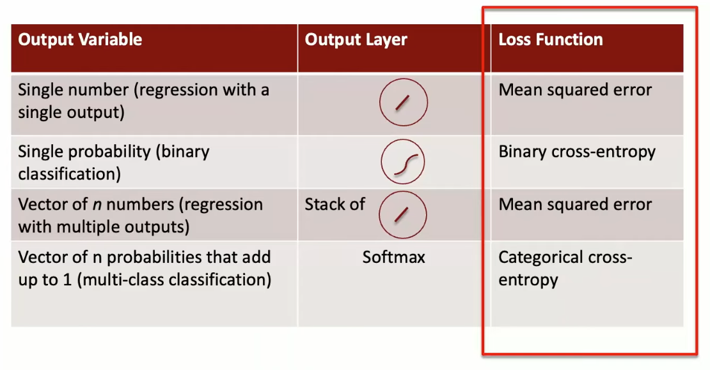
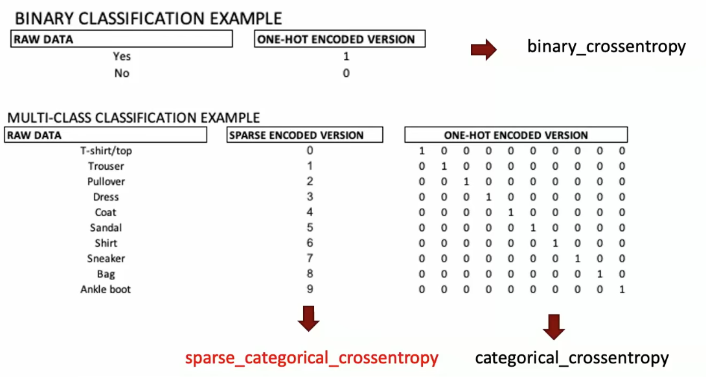

# Lecture 3 - Deep Learning for Computer Vision - Building Convolutional Neural Networks from Scratch

- What is an epoch?
    - One pass through the full training set.

- An epoch in Stochastic Gradient Descent:
    - Process the data in minibatches
    - Compute gradient descent on just the batch
        - Weights are updated and the epoch is complete for that minibatch.
        - Compute the next minibatch with the weights of the previous update.
            - Running updates of the weights relative to each minibatch.

- Underfitting vs. Overfitting
    - The more complex the model, the error on the training data goes down.
    - Overfitting: Model captures idiosyncrasies of training data
    - Underfitting: MOdel cannot capture the rich
    - Regularization: The way we handle the risk of overfitting.
        - Early Stopping: Stop the training early before the training loss is minimized by monitoring the loss on a validation set.
        
        - Dropout: Randomly zero out the output from some of the nodes in a hidden layer.
        

- Introduction to Keras and TensorFlow

- What is a Tensor?
    - Rank 0: Scalar
    - Rank 1: Vector
    - Rank 2: Table (b/w images)
    - Rank 3: A bunch of tables (cube) (color images)
    - Rank 4: Video

- TensorFlow: A library that provides:
    - Automatic calculation of gradients of complicated loss functions
    - Library of state-of-the-art optimizers
    - Automatic distribution of computational load across servers
    - Automiatic adaptation of code to work on parallel hardware (GPUs and TPUs)

- Keras: Sits on top of TensorFlow and provides "convienence" features 
    - Pre-defined layers
    - Incredibly flexible ways to specify network architectures
    - Easy ways to preprocess data
    - Easy ways to train models and report metrics
    - Pre-trained models you can download and customize
    - Keras API
        - Sequential
        - Functional API
        - 

## Computer Vision

- Greyscale images: Pixels are in a 2D grid with a value 0 (black) to 255 (white) for the light intensity of that pixel. 
    - This grid of pixels makes up a greyscale image.

- Color Images: Pixels are made up of 3 colors red, green, blue. 
    - Values 0 to 255 for intensity of that color (red, green blue). When blended together, creates colors on the spectrum.

- Image Classification: Determining what object (classification) and where the object (localization) is in an image.
    - Object Detection: Picking up all the objects in the image and localizing them (identifying their location) in an image. 
    - Semantic Segmentation: Every pixel needs to be classified into one of N categories.
    - Instant Segmentation: Every pixel needs to be classified into one of N categories AND different instanfces of the same category need to be identfied. (sheep 1, sheep 2, sheep 3, etc.)

- Fashion MNIST: A fashion-mnist dataset of images of clothing types. 
    - Input: 28x28 picture.
        - Flattent the table of numbers into a vector.
            - Rotating rows vertically and stacking the rows into a vector.
        
    - Output: 10 possible options/outcomes
        - The 10 outputs add to one where one outputs value is larger or more probable outcome. 
            - The Softmax Layer: Takes in `n` arbitrary numbers and converts them to `n` probabilities.
            

